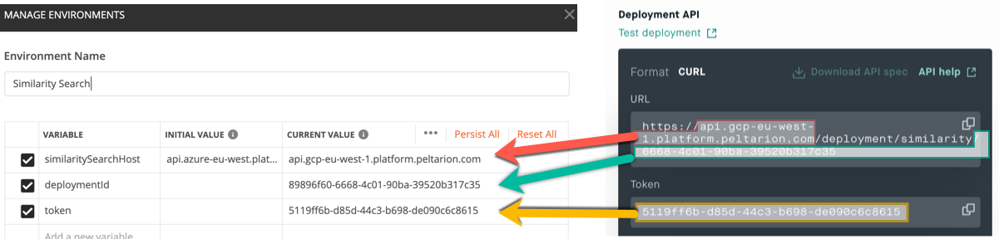
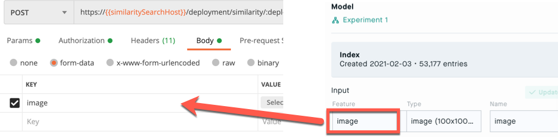
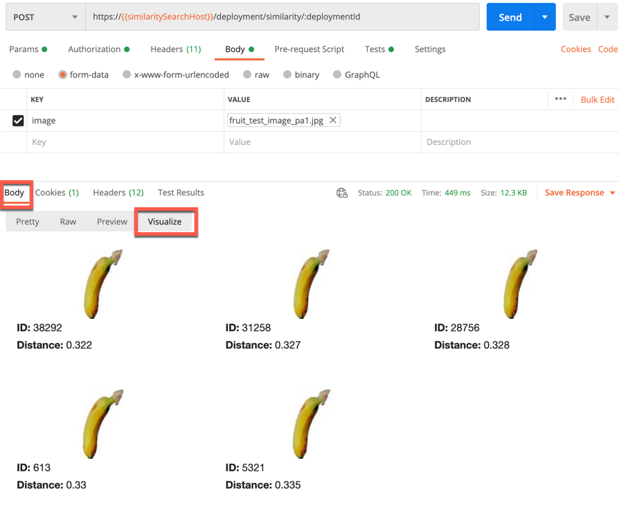

# Test your image similarity deployment with Postman

Follow these instructions to test you deployment with 
[Postman](https://www.postman.com/).

## 1. Deploy an experiment on the Peltarion Platform

Deploy an experiment on the [Peltarion Platform](https://platform.peltarion.com/).

## 2. Configure Postman
1. Download this repository to your computer.
2. Open the Postman app.
3. Import both json-files from your local version if this repo into Postman.
4. In the top-right corner of Postman, select the `Similarity Search` environment in the Environment-dropdown (from the start, it says `No environment`).

## 3. Manage environment
1. Click the eye button next to the Environment-dropdown.
2. Click `Edit` to open the _Manage environments_ window.
3. In a separate window, navigate to the _Deployment view_ on the Peltarion Platform.
4. Copy the environment variables from the _Deployment view_ to the _CURRENT VALUE_ column in the _Manage environments_ window: 

- Copy the similarity search host `address` from the URL to the **similarySearchHost** field, for example, `api.gcp-eu-west-1.platform.peltarion.com`.
- Copy the deployment `ID` from the end of the URL to the **deploymentID** field, for example, `89896f60-6668-4c01-90ba-39520b317c35`. **!!** Make sure you get all the digits. Some might be hidden in the interface. **!!**
- Copy the `Token` to the **token** field, for example, `5119ff6b-d85d-44c3-b698-de090c6c8615`.

## 4. Test your deployment with an image
1. Click `Collections` and then POST `Image Similarity Search`.
1. Click the `Body` tab.
1. Update the **KEY** value to your experiment's `Input feature`.

1. Click `Select file` and pick a local image to test your deployment to find similar images.
1. Click `Send` and wait ...
1. Click the `Visualize` tab to see the most similar images in your dataset. The lower the **Distance**, the more similar the image is to your test image according to your deployed model.

